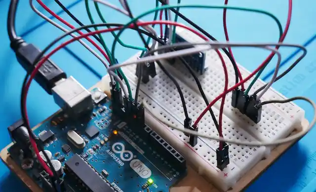

# Électroniques

Cette section est destinée à vous aider à mieux comprendre les technologies des microcontrôleurs et des ordinateurs monocartes, notamment les Arduinos, les Raspberry Pi, le Makey Makey et l'Internet des objets (IoT). Ces technologies sont utilisées dans de nombreux domaines, tels que la robotique, l'automatisation industrielle, les systèmes embarqués, la domotique et les projets personnels d'électronique. 

---

## Arduino

{ width=400rem align=left } 

Arduino est une plateforme de développement *open-source* populaire pour les projets électroniques. Elle se compose d'une carte électronique programmable et d'un environnement de développement (Arduino IDE) qui permet aux utilisateurs de créer des projets interactifs en contrôlant les entrées et les sorties. Les cartes Arduino sont faciles à utiliser, abordables et peuvent être personnalisées pour répondre à des besoins spécifiques.

[Découvrir Arduino](arduino){ .md-button .md-button--primary }

---

## Raspberry Pi

{ width=400rem align=left } 

Le Raspberry Pi est un ordinateur monocarte abordable et polyvalent qui a été développé pour encourager l'apprentissage de l'informatique et de l'électronique. Il dispose d'un processeur puissant, de ports USB, de ports Ethernet, d'un port HDMI, d'un connecteur pour une caméra et de broches GPIO pour la connexion de périphériques électroniques.

[Découvrir Raspberry Pi](raspberrypi){ .md-button .md-button--primary }

 

---

## Internet des Objets

{ width=400rem align=left } 

L'Internet des Objets (*IoT*) est une technologie en constante évolution qui permet la connexion de différents types d'objets à internet, allant des appareils domestiques tels que les thermostats et les lumières, aux équipements industriels tels que les capteurs de température et les systèmes de surveillance. L'ESP8266 est un microcontrôleur qui est souvent utilisé dans les projets *IoT* en raison de sa connectivité Wi-Fi intégrée et de sa faible consommation d'énergie.

[Découvrir l'Internet des Objets](iot){ .md-button .md-button--primary }