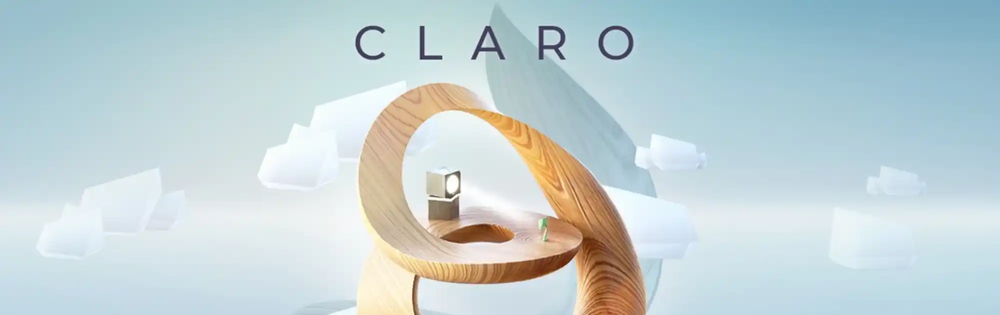
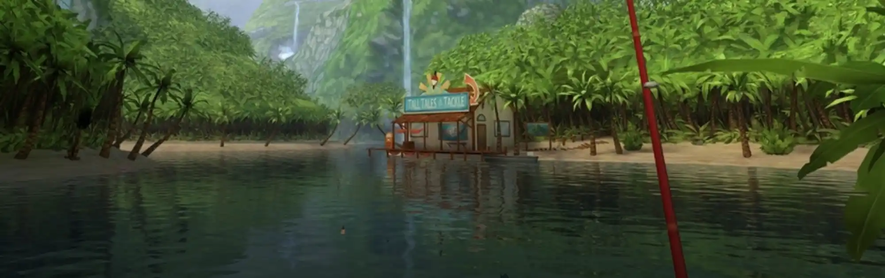
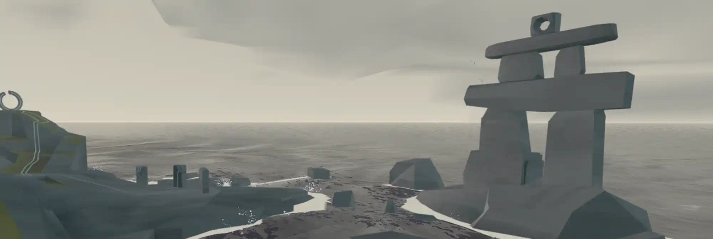
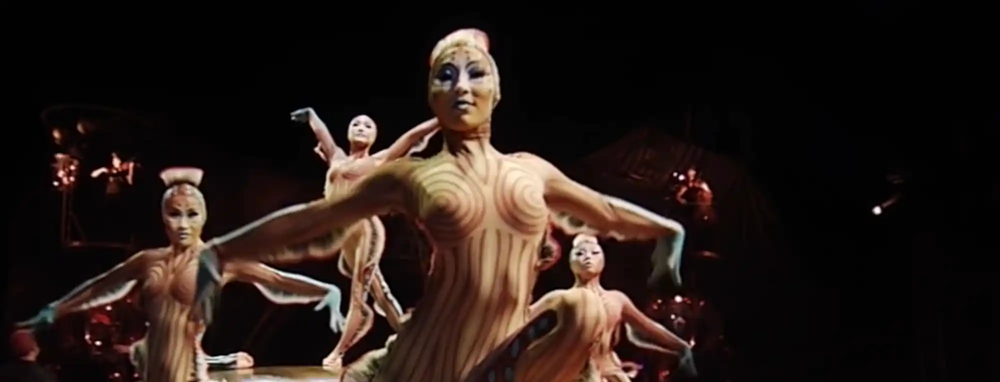
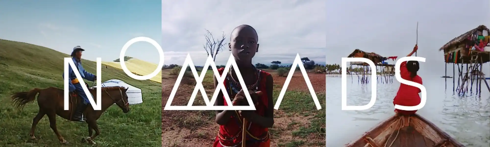
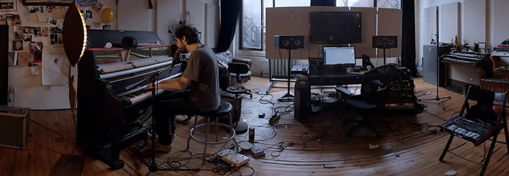
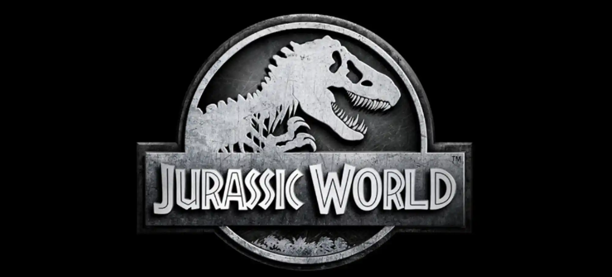
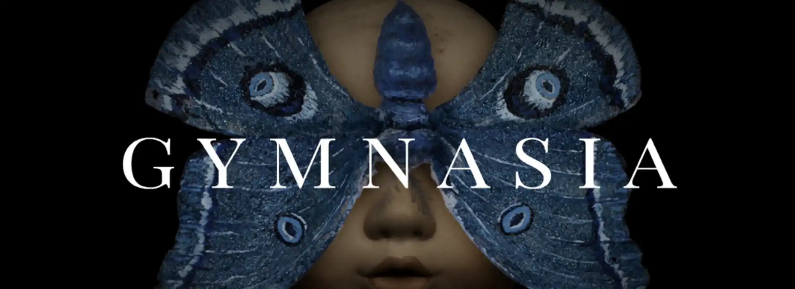
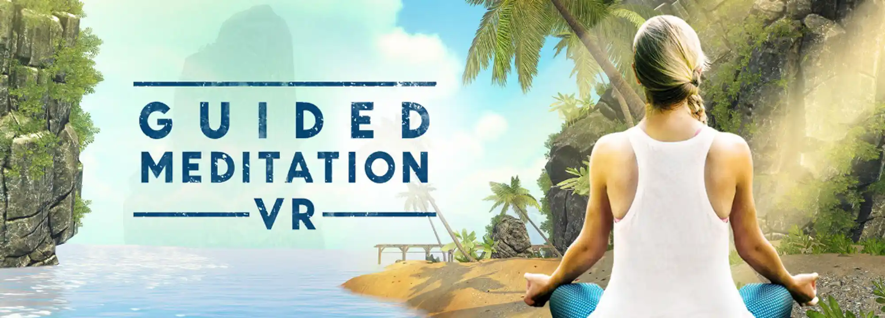
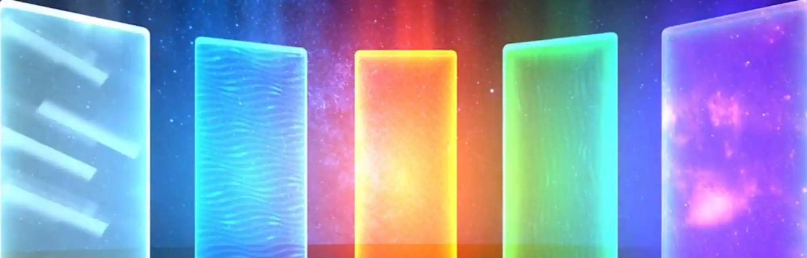

## Introduction à la réalité virtuelle

### *Introduction to Virtual Reality*

!!! question ""
    __Catégorie__ : Introduction à la réalité virtuelle

!!! info ""
    Recommandé pour les premiers pas dans la réalité virtuelle.

**Création** : Felix & Paul Studios
**Date** : 2019
**Durée** : 3 min.

Découvrez un aperçu des différentes expériences réalisées par le studio montréalais Felix & Paul, du Cirque du Soleil au monde des dinosaures.

[Source](http://felixandpaul.com/?introtovr2)

---

## Jeu

### *Claro*

!!! question ""
    __Catégorie__ : Jeu

!!! warning "" 
    :heart: Coup de cœur de l’équipe

**Création** : Superbright
**Date** : 2018
**Durée** : N/A

Ce jeu de casse-tête minimaliste à l’ambiance zen vous demande de déplacer le soleil et des miroirs pour diriger la lumière afin de faire pousser un arbre.

[Source](http://oculus.com/experiences/go/1809897762383106/)

---

### *Floor plan*

!!! question ""
    __Catégorie__ : Jeu

!!! info ""
    Cette application nécessite peu d’interaction et peu de mouvement du corps en général.

**Création** : Turbo Button
**Date** : 2016
**Durée** : N/A

*Floor Plan* est un jeu de casse-tête de type « point-and-click » se déroulant dans un ascenseur. Vous devrez trouver différents objets vous permettant d’interagir avec votre environnement pour accéder aux autres paliers.

[Source](http://turbo-button.com/games/floorplan)

---

### *Bait*

!!! question ""
    __Catégorie__ : Jeu

!!! info ""
    Cette application nécessite peu d’interaction et peu de mouvement du corps en général.

**Création** : Resolution Games
**Date** : 2016
**Durée** : N/A

Dans ce jeu de simulation de pêche, vous aurez l’occasion de vous familiariser avec l’utilisation de la manette. Le décor accueillant et la musique calme contribuent à l’ambiance relaxante.

[Source](http://resolutiongames.com/bait)

---

### *Land's End*

!!! question ""
    __Catégorie__ : Jeu

!!! info ""
    Cette application nécessite peu d’interaction et peu de mouvement du corps en général.

**Création** : Ustwo Games
**Date** : 2015
**Durée** : N/A

*Land’s End* est un jeu d’énigme à résoudre pour avancer dans un archipel et découvrir les mystères qu’il renferme. 

[Source](http://landsendgame.com)

---

### *Breaking boundaries in science*

!!! question ""
    __Catégorie__ : Jeu

!!! info ""
    Le texte et les dialogues sont en anglais.

**Création** : Filament Games
**Date** : 2018
**Durée** : N/A

*Breaking Boundaries in science* présente trois scènes quotidiennes dans la vie de trois femmes scientifiques qui ont marqué l’histoire : Marie Curie, Jane Goodall, et Grace Hopper. Apprenez-en plus sur leur vie tumultueuse en recherchant des indices dissimulés un peu partout dans l’espace.

[Source](http://filamentgames.com/project/breaking-boundaries/)

---

## Documentaire

### Cirque du Soleil

!!! question ""
    __Catégorie__ : Documentaire

!!! info ""
    Cette expérience ne nécessite aucune interaction et se déroule en 360 degrés. Un fauteuil pivotant est recommandé pour le visionnement.

!!! warning "" 
    :heart: Coup de cœur de l’équipe

**Création** : Felix & Paul Studios
**Date** : 2018
**Durée** : 60 min.

Il s’agit d’une sélection de 5 films en réalité virtuelle d’environ 10 à 15 minutes chacun. Ils sont inspirés d’extraits de spectacles du Cirque du Soleil : Alegria, KÀ, Kurios, Luzia et O. Parfois étranges, souvent spectaculaires, mais toujours époustouflants, ces court-métrages sont une belle manière de découvrir quelques uns des spectacles du Cirque du Soleil.

[Source](http://cirquedusoleil.com/other-activities/vr-app)

---

### *Nomads*

!!! question ""
    __Catégorie__ : Documentaire

!!! info ""
    Cette expérience ne nécessite aucune interaction et se déroule en 360 degrés. Un fauteuil pivotant est recommandé pour le visionnement.

**Création** : Felix & Paul Studios
**Date** : 2016
**Durée** : 30 min.

La série *Nomads* vous transporte dans la réalité intime de trois cultures nomades.
Découvrez le mode de vie des éleveurs de yaks dans les steppes mongoles, des Maasai au Kenya et des gitans de la mer vivant au large de Bornéo, à travers trois courts métrages présentant des scènes quotidiennes.

[Source](http://oculus.com/experiences/gear-vr/820253268102944)

---

### *Space Explorers*

!!! question ""
    __Catégorie__ : Documentaire

!!! info ""
    Cette expérience ne nécessite aucune interaction et se déroule en 360 degrés. Un fauteuil pivotant est recommandé pour le visionnement.

**Création** : Felix & Paul Studios
**Date** : 2018
**Durée** : 39 min.

*Space Explorers* est une série de deux épisodes portant sur la formation de jeunes astronautes de différentes nationalités et sur les avancées technologiques liées à l’exploration spatiale. On y parle entres autres des nouvelles collaborations entre la NASA et des entreprises privées.

[Source](http://oculus.com/experiences/go/1750042515043543)

---

### *Notes on blindness*

!!! question ""
    __Catégorie__ : Documentaire

!!! info ""
    Casque d’écoute recommandé.
    Le contenu de cette application peut indisposer certaines personnes.

Expérience basée sur le long métrage documentaire Notes on Blindness, réalisé par Peter Middleton et James Spinney.

**Création** : Arte Experience
**Date** : 2016 
**Durée** : 7 min. 
**Langues** : français, anglais, allemand

*Notes on blindness* est un court voyage immersif 360 degrés dans le monde de la cécité, tiré des expériences intimes et psychologiques de l’écrivain et théologien John Hull, devenu aveugle dans les années 80. Laissez-vous guider par des sons spatialisés, éveillant ainsi vos sens à l’idée d’être privé de la vue.

[Source](http://arte.tv/digitalproductions/fr/notes-on-blindness/)

---

### *Anne Frank house*

!!! question ""
    __Catégorie__ : Documentaire

!!! info ""
    Le contenu de cette application peut indisposer certaines personnes.

**Création** : ForceField
**Date** : 2018 
**Durée** : N/A 

Visitez l’«Annexe secrète» où Anne Frank et sa famille ont vécu cachés durant la Deuxième Guerre mondiale. En plus de découvrir les pièces fidèlement recréées de l’annexe, des vidéos, des photos d’archives et des extraits du journal intime d’Anne Frank sont rendus disponibles dans cette application.

Deux modes d’exploration sont offerts : le premier met en perspective cette époque importante de l’histoire humaine, le second permet une visite libre de l’annexe.

[Source](http://annefrankhousevr.com/)

---

### *Strangers with Patrick Watson*

!!! question ""
    __Catégorie__ : Documentaire

!!! info ""
    Casque d’écoute recommandé.

[Source](http://oculus.com/experiences/go/842698025796123)

**Création** : Felix & Paul Studios
**Date** : 2018 
**Durée** : 20 min.

Entrez dans le studio montréalais de Patrick Watson, auteur-compositeur canadien. Assistez à sa prestation solo avec la sensation d’être à proximité de l’artiste, son piano et son chien.

---

## Animation

### *The Rose and I*

!!! question ""
    __Catégorie__ : Animation

!!! info ""
    Assez confortable, cette expérience est une belle initiation à la VR.

**Création** : Alexander Woo
**Date** : 2015
**Durée** : 5 min.

Librement inspiré du Petit Prince d'Antoine de Saint-Exupéry, ce court métrage
d’animation permet un peu d’interaction. Les mouvements possibles dans cette
application donne l’impression de faire partie du décor.

[Source](http://penrosestudios.com/the-rose-and-i/)

---

### *Jurassic World Blue*

!!! question ""
    __Catégorie__ : Animation

!!! info ""
    Un peu d’action et quelques scènes d’épouvante. L’animation et le mouvement permettent une plus grande immersion.

**Création** : Felix & Paul Studios
**Date** : 2018 
**Durée** : 10 min.

Il s’agit d’une animation « sur rail » dont l’action se déroule principalement à 180 degrés. Vous y suivez les aventures de Blue, le dinosaure vedette de la nouvelle mouture de la franchise *Jurassic Park*.

[Source](http://felixandpaul.com/index-fr.html?jurassicworldblue)

---

### *Dear Angelica*

!!! question ""
    __Catégorie__ : Animation

!!! info ""
    Plutôt confortable comme expérience, cette application ne nécessite aucune interaction et se déroule à 360 degrés. Un fauteuil pivotant est recommandé pour le visionnement.

**Création** : Saschka Unseld
**Date** : 2017 
**Durée** : 15 min.

Des studios Oculus Story, *Dear Angelica* est un voyage onirique qui nous fait découvrir les souvenirs qu’une jeune femme a de sa mère. Entièrement peint à la main, cette animation se déroule dans une série de souvenirs qui se déploient autour de vous. Mettant en vedette Geena Davis et Mae Whitman.

[Source](http://oculus.com/story-studio/films/dear-angelica)

---

### *Singularity*

!!! question ""
    __Catégorie__ : Animation

**Création** : Relajaelcoco
**Date** : 2017 
**Durée** : 4 min.

*Singularity* est une animation débridée où formes et couleurs s'entremêlent dans un environnement en 3D et à 360 degrés, redéfinissant ainsi les possibilités de la conception graphique.

---

### *Sonar*

!!! question ""
    __Catégorie__ : Animation

**Création** : Philipp Maas, Dominik Stockhausen
**Date** : 2016 
**Durée** : 6 min.

*Sonar* est le premier court métrage d’animation de science-fiction en réalité virtuelle. Un drone aperçoit un astéroïde et entreprend de l’explorer de plus près. C'est en parcourant un labyrinthe étrange qu’il découvrira la face cachée de l’espace...

[Source](http://sonar-360.com/)

---

### *Gymnasia*

!!! question ""
    __Catégorie__ : Animation

**Création** : Chris Lavis et Maciek Szczerbowski (Clyde Henry Productions)
**Production** : Office national du film du Canada et Felix & Paul Studios
**Date** : 2019 
**Durée** : 6 min.

*Gymnasia* est un court métrage d’animation qui explore la thématique du souvenir. Vous êtes plongé.e dans le gymnase d’une école abandonnée dans une ambiance onirique.

[Source](http://onf.ca/interactif/Gymnasia/)

---

## Détente

### *Guided meditation*

!!! question ""
    __Catégorie__ : Détente

!!! info ""
    Très peu d’animation et de mouvement. Application VR confortable et propice à la relaxation.

**Création** : Cubicle Ninjas
**Date** : 2016 
**Durée** : N/A

Méditation guidée en français dans le décor de votre choix. Choix de séance avec ou sans musique. Plusieurs possibilités de personnalisation des séances.

[Source](http://cubicleninjas.com/portfolio/guided-meditation-vr/)

---

### *Liminal*

!!! question ""
    __Catégorie__ : Détente

!!! info ""
    La création d’un compte gratuit permet d’accéder à plus de contenu.
[Source](http://liminalvr.com/liminal-platform/)

**Création** : Liminal VR
**Date** : 2020 
**Durée** : N/A

*Liminal* est une application destinée à la relaxation qui associe animations 3D et jeux de type « méditation ». De belle facture et accompagnés de musique, les différents jeux offerts nécessitent un peu d’interaction, dont quelques mouvements du corps, alors que les « espaces » de relaxation sont plus statiques. Selon les créateurs de l’application, les jeux et animations s’inspirent de la recherche en neuroscience et en psychologie pour induire ou augmenter des états émotionnels et cognitifs particuliers.