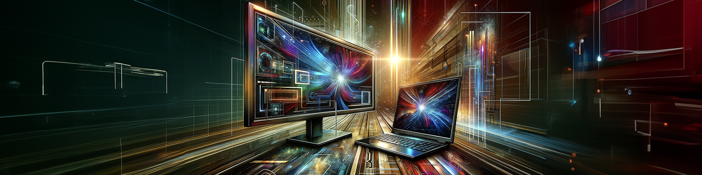

---
hide:
  - footer
  - toc
search:
  exclude: true
glightbox: false
icon : material/monitor
---

# Postes Apportez Votre Appareil (AVA)

Les bibliothèque UdeM mettent à votre disposition des postes Apportez Votre Appareil (AVA) qui vous permettent de brancher votre ordinateur portable à un écran large en HDMI ou USB-C. Vous aurez également accès à un clavier et à une souris externes pour une meilleure ergonomie. N'hésitez pas à profiter de ce service!

## Comment ça marche?

1) Trouvez un poste AVA disponible dans [les bibliothèques participantes](#localisation).

2) Branchez votre ordinateur portable à l'écran à l'aide du câble HDMI ou USB-C.

3) Connectez le clavier et la souris à l'aide de l'USB-A ou USB-C.

4) Commencez à travailler!

## Disponibilité

| Localisation   |      Nombre      |
|----------|:-------------|
| Droit | 11 postes |
| Mathématiques et informatique| 1 poste |
| Sciences | 2 postes |

## Aide

??? Question "Dois-je apporter mes propres câbles et adaptateurs?"
    Non, le poste est déjà équipé de câbles avec des adaptateurs HDMI vers USB-C pour le moniteur et USB-A vers USB-C pour le clavier et souris.

??? Question "Quels types d'appareils sont compatibles avec les postes AVA?"
    La plupart des ordinateurs portables dotés d'un port HDMI ou USB-C sont compatibles.

??? Question "Ma fenêtre ne s'affiche pas sur l'entièreté de l'écran externe."
    Ajuster les paramètres d'affichage de votre ordinateur pour correspondre à la résolution de l'écran.
    === "Windows"
    === "macOS"

??? Question "Que dois-je faire si j'ai des problèmes techniques avec un poste AVA?"
    Veuillez contacter le personnel des bibliothèques au comptoir pour obtenir de l'aide.
